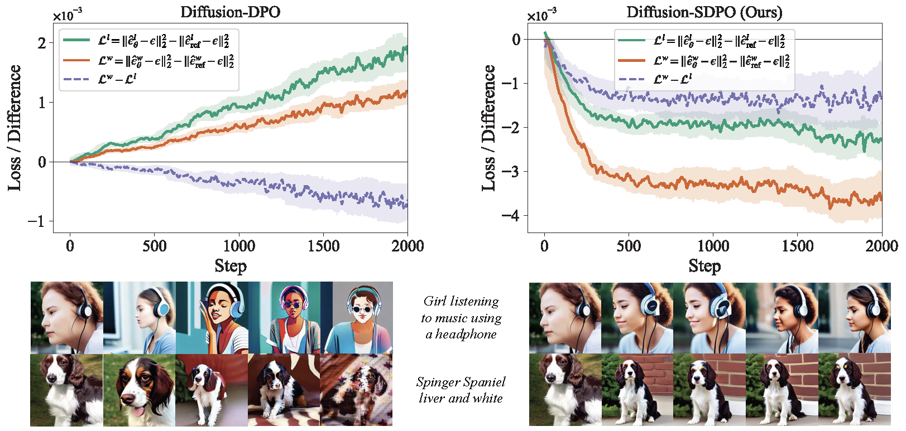

# Diffusion-SDPO: Safeguarded Direct Preference Optimization for Diffusion Models

<p align="center">
  <a href="https://huggingface.co/AIDC-AI/Diffusion-SDPO">
    
  </a>
</p>

## 📝 Introduction

**Diffusion-SDPO** is a plug-in training rule for preference alignment of diffusion models. It computes an adaptive scale for the loser branch based on the alignment between winner and loser output-space gradients, so that each update theoretically **does not increase the winner's loss to first order**. This preserves the preferred output while still widening the preference margin. The safeguard is model-agnostic and drops into Diffusion-DPO, DSPO, and DMPO with negligible overhead. See [our paper](https://arxiv.org/abs/2511.03317) for details (derivation of the safety bound, the output-space approximation, and the closed-form solution). 

This repository is the official implementation of paper [Diffusion-SDPO](https://arxiv.org/abs/2511.03317).



## 🔧 Setup

```bash
pip install -r requirements.txt
```

## 📦 Model Checkpoints

All checkpoints are initialized from Stable Diffusion (SD1.5 or SDXL) and trained as described in the paper.  
Each name below means *{base model} + {DPO variant} with our safeguarded winner-preserving rule (SDPO)*:

- [**SD1.5-Diffusion-DPO (with SDPO)**](https://huggingface.co/AIDC-AI/Diffusion-SDPO/blob/main/sd1.5/diffusion-dpo/unet.pth) — SD1.5 + Diffusion-DPO augmented by our safeguard  
- [**SD1.5-DSPO (with SDPO)**](https://huggingface.co/AIDC-AI/Diffusion-SDPO/blob/main/sd1.5/dspo/unet.pth) — SD1.5 + DSPO augmented by our safeguard  
- [**SD1.5-DMPO (with SDPO)**](https://huggingface.co/AIDC-AI/Diffusion-SDPO/blob/main/sd1.5/dmpo/unet.pth) — SD1.5 + DMPO augmented by our safeguard  
- [**SDXL-Diffusion-DPO (with SDPO)**](https://huggingface.co/AIDC-AI/Diffusion-SDPO/blob/main/sdxl/diffusion-dpo/unet.pth) — SDXL + Diffusion-DPO augmented by our safeguard  
- [**SDXL-DSPO (with SDPO)**](https://huggingface.co/AIDC-AI/Diffusion-SDPO/blob/main/sdxl/dspo/unet.pth) — SDXL + DSPO augmented by our safeguard  
- [**SDXL-DMPO (with SDPO)**](https://huggingface.co/AIDC-AI/Diffusion-SDPO/blob/main/sdxl/dmpo/unet.pth) — SDXL + DMPO augmented by our safeguard


## 🚀 Model Training

### Example: SD1.5 + Diffusion-DPO with SDPO safeguard

Start training by running the provided script. It auto-detects the number of GPUs and launches with `accelerate`.

```bash
bash scripts/train/sd15_diffusion_dpo.sh
```

**Key arguments in this example**

* `--train_method` selects Diffusion-DPO as the baseline. Choices : [diffusion-dpo, dspo, dmpo]
* `--beta_dpo` controls the DPO temperature or strength.
* `--use_winner_preserving` enables our SDPO safeguard that rescales only the loser branch’s backward signal to avoid increasing the winner loss to first order.
* `--winner_preserving_mu` sets the safeguard strength. Larger values are more conservative.
* `--mixed_precision bf16` and `--allow_tf32` improve throughput on recent NVIDIA GPUs.

## 📊 Evaluation

We provide one-click evaluation scripts for SD1.5 and SDXL. They take a `unet.pth` checkpoint and will:
1) generate images for three prompt groups: **papv2**, **hpsv2**, **partiprompts**
2) compute **PickScore**, **HPSv2**, **Aesthetics**, **CLIP**, and **ImageReward**
3) print a summary to the console
4) optionally, compare two model checkpoints and report per-metric win rates across all prompts


The prompts come from `prompts/`:
- `papv2.json` is deduplicated from the [Pick-a-Pic v2](https://huggingface.co/datasets/yuvalkirstain/pickapic_v2) test set to ensure prompts are unique
- `hpsv2.json` and `partiprompts.json` are standard prompt suites used for qualitative and quantitative checks integrated from [HPDv2](https://huggingface.co/datasets/zhwang/HPDv2/tree/main/benchmark) and [Parti](https://github.com/google-research/parti).

### Quick start

**SD1.5 checkpoint**
```bash
bash scripts/eval/test_sd15.sh /path/to/your/unet.pth
```

**SDXL checkpoint**
```bash
bash scripts/eval/test_sdxl.sh /path/to/your/unet.pth
```

**Win-rate comparison**
```bash
# A/B win-rate comparison across all prompts from one group (papv2, hpsv2, partiprompts)
# A.json / B.json are the generation manifests produced by your eval runs.

bash scripts/eval/test_vs.sh \
  --json_a path/to/A.json \
  --json_b path/to/B.json \
  --label_a "your label A" \
  --label_b "your label B"
```
Example:
```bash
bash scripts/eval/test_vs.sh \
  --json_a /path/to/sdxl/diffusion-dpo/hpsv2_seed0_1024x1024_50s_7.5cfg.json \
  --json_b /path/to/sdxl/dmpo/hpsv2_seed0_1024x1024_50s_7.5cfg.json \
  --label_a "diffusion_dpo_sdxl_hpsv2" \
  --label_b "dmpo_sdxl_hpsv2"
```


## 📚 Citation

If you find TeEFusion helpful, please cite our paper:

```bibtex
@article{fu2025diffusion,
  title={{Diffusion-SDPO}: Safeguarded Direct Preference Optimization for Diffusion Models},
  author={Fu, Minghao and Wang, Guo-Hua and Cui, Tianyu and Chen, Qing-Guo and Xu, Zhao and Luo, Weihua and Zhang, Kaifu},
  journal={arXiv:2511.03317},
  year={2025}
}
```

## 🙏 Acknowledgments

The code is built upon [Diffusers](https://github.com/huggingface/diffusers), [Transformers](https://github.com/huggingface/transformers), [Diffusion-DPO](https://github.com/SalesforceAIResearch/DiffusionDPO) and [DSPO](https://github.com/huaishengzhu/DSPO/tree/main).

## 📄 License

This project is licensed under the Apache License, Version 2.0 (SPDX-License-Identifier: Apache-2.0).

## 🚨 Disclaimer

We used compliance checking algorithms during the training process, to ensure the compliance of the trained model(s) to the best of our ability. Due to complex data and the diversity of language model usage scenarios, we cannot guarantee that the model is completely free of copyright issues or improper content. If you believe anything infringes on your rights or generates improper content, please contact us, and we will promptly address the matter.

